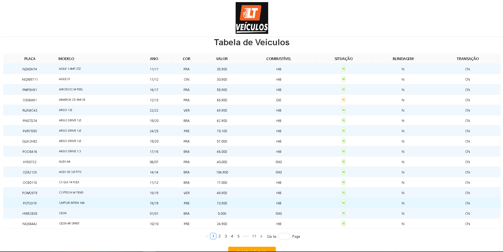

# 🧩 Tabela Veículos LT 

## 📖 Descrição

O **Tabela Veículos LT** é um frontend desenvolvido em **React com Vite** como **amostra prévia** para a empresa **LT Veículos**.  
O projeto foi padronizado em conformidade com o banco de dados real da empresa, garantindo consistência e servindo como base para futuras integrações.

---

## 🎮 Preview



👉 [Acessar agora na Vercel](https://site-tabela-lt-veiculos.vercel.app/)

[](https://site-tabela-lt-veiculos.vercel.app/)

---

## ⚡ Funcionalidades

- Exibição de tabela de veículos.  
- Padronização de dados conforme a base da LT Veículos.  
- Interface simples, ágil e responsiva.  
- Estrutura pronta para integração com backend.  

---

## 📚 Conceitos praticados

- Organização de componentes em **React**.  
- Utilização do **Vite** para build e ambiente de desenvolvimento rápido.  
- Estilização com **CSS modular**.  
- Separação de responsabilidades e boas práticas.  

---

## 🛠️ Tecnologias

- **React (Vite)**  
- **JavaScript (ES6+)**  
- **HTML5 & CSS3**  

---

## 🚀 Como usar

1. Clone o repositório:
    
    ```bash
    git clone https://github.com/Matheus-TecDev/TabelaVeiculosLT.git
    ```
    
2. Acesse a pasta do projeto:
    
    ```bash
    cd TabelaVeiculosLT/frontend
    ```
    
3. Instale as dependências:
    
    ```bash
    npm install
    ```
    
4. Rode o projeto em ambiente de desenvolvimento:
    
    ```bash
    npm run dev
    ```
    
📍 O projeto estará disponível em [http://localhost:5173](http://localhost:5173)  

---

## 🤝 Contribuição

Sugestões de melhorias são **muito bem-vindas**!  

- Abra uma **issue** para relatar bugs ou propor ideias.  
- Envie um **Pull Request** com suas contribuições.  

---

## 📌 Roadmap (versões futuras)

- 📱 Melhorar responsividade para dispositivos móveis.  
- 📊 Criar novas telas de visualização de dados.  
- 🌐 Deploy oficial e demonstração online.  
- 🔗 Integração completa com API backend.  

---

## 👨‍💻 Autores

- [Matheus Freire](https://github.com/Matheus-TecDev)  
- [LinkedIn](https://www.linkedin.com/in/matheus-freire-martins-da-costa-318622376/) 
 
📫 Contato: matheus.tecnodev@gmail.com  

🤝 Projeto desenvolvido em parceria com a empresa DTI como amostra para **LT Veículos**.  
